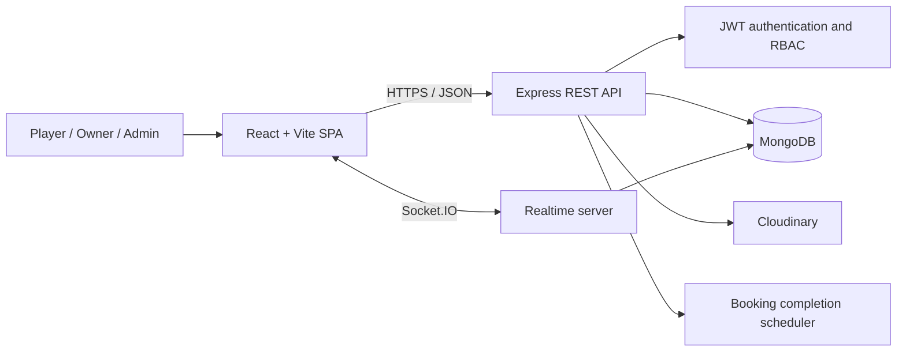

# Malaab — Football Stadium Booking Platform

<p align="center">
  <strong>Discover, compare, and reserve football stadiums from one modern platform.</strong>
</p>

<p align="center">
  
  
  
  
  
</p>

Malaab is a full-stack marketplace that connects football players with stadium owners. Players can discover nearby venues, inspect availability, make and manage reservations, and review completed experiences. Owners can publish stadiums, manage photos, and monitor booking activity. Administrators manage platform accounts through protected APIs.

The application combines a responsive React interface with a modular Express REST API, MongoDB persistence, JWT-based access control, Cloudinary image storage, background booking automation, and real-time communication infrastructure.

<p align="center">
  
</p>

## Table of contents

- [Project highlights](#project-highlights)
- [User roles](#user-roles)
- [Architecture](#architecture)
- [Technology stack](#technology-stack)
- [Core business rules](#core-business-rules)
- [Repository structure](#repository-structure)
- [Getting started](#getting-started)
- [Environment variables](#environment-variables)
- [Available commands](#available-commands)
- [API overview](#api-overview)
- [Testing and quality](#testing-and-quality)
- [Current scope](#current-scope)

## Project highlights

- Responsive stadium discovery experience with search, filters, cards, loading states, and interactive maps.
- Stadium detail pages with galleries, facilities, working hours, reviews, pricing, and availability.
- Secure registration and login with persistent JWT authentication and role-protected routes.
- Exact-hour booking workflow with availability checks, conflict prevention, cancellation rules, and status tracking.
- Dedicated player and owner dashboards with statistics and recent activity.
- Player booking history, cancellation flow, and post-completion reviews.
- Owner stadium creation and Cloudinary-backed photo management.
- In-app notifications for bookings, cancellations, messages, and account administration.
- REST and Socket.IO messaging infrastructure for conversations between eligible players and stadium owners.
- Swagger/OpenAPI documentation and automated backend integration tests.

## User roles

| Role | Main capabilities |
| --- | --- |
| **Player** | Browse stadiums, use the map, view availability, reserve a time slot, cancel eligible bookings, manage a profile, receive notifications, and review completed bookings. |
| **Owner** | Create and manage stadiums, configure working hours, upload and organize stadium photos, review bookings, and monitor dashboard activity. |
| **Admin** | List and inspect users, activate or deactivate accounts, cancel bookings when required, and retain an audit trail of administrative actions. |

Authorization is enforced on both sides: React protects role-specific pages, while the API independently authenticates every protected request and checks the user's role and resource ownership.

## Architecture



The backend follows a feature-oriented modular structure. Each domain owns its model, validation, service, controller, and routes. Shared middleware provides authentication, authorization, request validation, upload handling, and centralized error responses.

The frontend is organized around feature modules, reusable UI components, route layouts, API hooks, and pages. TanStack Query manages server state and caching; Zustand stores authentication state; Zod and React Hook Form handle client-side validation and forms.

## Technology stack

| Layer | Technologies |
| --- | --- |
| Frontend | React 19, TypeScript, Vite, React Router, Tailwind CSS |
| Data fetching and state | Axios, TanStack Query, Zustand |
| Forms and validation | React Hook Form, Zod |
| Maps and UI | MapLibre GL, React Map GL, Lucide React, React Hot Toast |
| Backend | Node.js, Express 5, TypeScript |
| Database | MongoDB, Mongoose |
| Security | JWT, bcrypt, Helmet, CORS, role-based authorization |
| Media | Multer, Cloudinary |
| Realtime | Socket.IO |
| API documentation | OpenAPI 3, Swagger UI |
| Testing and quality | Jest, Supertest, ts-jest, Oxlint, TypeScript |

## Core business rules

- A booking lasts exactly one hour and must begin on an exact hour.
- Reservations can be made up to seven days in advance.
- Stadium working hours and existing confirmed reservations determine availability.
- Overlapping reservations are rejected by the backend.
- Players can cancel confirmed bookings until two hours before the start time; an administrator can intervene under broader rules.
- A background scheduler marks expired confirmed bookings as completed.
- Only completed bookings can be reviewed, and each booking can receive only one review.
- Stadium ratings and review counts are maintained from submitted reviews.
- A stadium owner can manage only their own stadiums, images, and booking information.
- Real stadium uploads replace fallback images, support one primary image, and are limited to five uploaded images per stadium.
- Inactive accounts cannot access protected endpoints.

## Repository structure

```text
reservation_staduim/
├── backend/
│   ├── src/
│   │   ├── config/          # Swagger configuration
│   │   ├── database/        # MongoDB connection
│   │   ├── modules/         # Auth, stadiums, bookings, reviews, images, etc.
│   │   ├── shared/          # Middleware, errors, constants, and shared types
│   │   ├── socket/          # Socket.IO authentication and event handlers
│   │   ├── app.ts           # Express application and route registration
│   │   └── server.ts        # Database, HTTP server, sockets, and scheduler
│   └── tests/               # Backend integration tests
├── frontend/
│   ├── public/              # Static assets
│   └── src/
│       ├── api/             # Axios client and interceptors
│       ├── components/      # Shared layout and UI components
│       ├── features/        # Auth, bookings, dashboards, and stadiums
│       ├── lib/             # Query client and shared helpers
│       ├── pages/           # Route-level screens
│       └── styles/          # Global styling
└── README.md
```

## Getting started

### Prerequisites

- Node.js 20.19+ or 22.12+
- npm
- A local MongoDB instance or MongoDB Atlas database
- A Cloudinary account for stadium image uploads

### 1. Clone the repository

```bash
git clone https://github.com/Gadridev/reservation_staduim.git
cd reservation_staduim
```

### 2. Install dependencies

```bash
npm --prefix backend ci
npm --prefix frontend ci
```

### 3. Configure the environment

Create `backend/.env` with the backend variables shown below. Then create the frontend environment file from its example:

```bash
cp frontend/.env.example frontend/.env
```

Never commit either `.env` file.

### 4. Start the application

Run the backend and frontend in separate terminals:

```bash
npm --prefix backend run dev
```

```bash
npm --prefix frontend run dev
```

Once both processes are running:

| Service | Local URL |
| --- | --- |
| Frontend | `http://localhost:5173` |
| REST API | `http://localhost:5000/api` |
| Health check | `http://localhost:5000/health` |
| Swagger UI | `http://localhost:5000/api-docs` |

## Environment variables

### Backend — `backend/.env`

```dotenv
NODE_ENV=development
PORT=5000
MONGODB_URI=mongodb://127.0.0.1:27017/malaab
MONGODB_URI_TEST=mongodb://127.0.0.1:27017/malaab_test
JWT_SECRET=replace_with_a_long_random_secret
JWT_EXPIRES_IN=7d
FRONTEND_ORIGIN=http://localhost:5173
CLOUDINARY_CLOUD_NAME=your_cloud_name
CLOUDINARY_API_KEY=your_api_key
CLOUDINARY_API_SECRET=your_api_secret
```

`MONGODB_URI_TEST` is required only when running the backend test suite. Use a dedicated test database because the tests clear their collections between cases.

### Frontend — `frontend/.env`

```dotenv
VITE_API_URL=http://localhost:5000/api
```

Variables prefixed with `VITE_` are bundled into frontend code and must never contain secrets.

## Available commands

### Backend

| Command | Purpose |
| --- | --- |
| `npm --prefix backend run dev` | Start the API in watch mode. |
| `npm --prefix backend run build` | Compile TypeScript into `backend/dist`. |
| `npm --prefix backend start` | Run the compiled server. |
| `npm --prefix backend test` | Run the Jest integration test suite serially. |

### Frontend

| Command | Purpose |
| --- | --- |
| `npm --prefix frontend run dev` | Start the Vite development server. |
| `npm --prefix frontend run build` | Type-check and create a production build. |
| `npm --prefix frontend run lint` | Run Oxlint. |
| `npm --prefix frontend run preview` | Preview the production build locally. |

## API overview

All primary API routes are served below `/api`. Protected requests use the following header:

```http
Authorization: Bearer <access-token>
```

| Module | Base route | Purpose |
| --- | --- | --- |
| Authentication | `/api/auth` | Registration, login, current user, profile, and password management |
| Stadiums | `/api/stadiums` | Discovery, owner stadium management, working hours, and availability |
| Stadium images | `/api/stadiums/:stadiumId/images` | Upload, list, select primary, and delete images |
| Bookings | `/api/bookings` | Create, retrieve, filter, cancel, and summarize reservations |
| Reviews | `/api/reviews` | Create and manage verified booking reviews |
| Notifications | `/api/notifications` | List notifications, unread count, and read status |
| Administration | `/api/admin` | Protected user management and account activation controls |

Interactive request schemas, parameters, security requirements, and response examples are available through Swagger UI at `/api-docs` while the backend is running.

### Realtime events

Socket connections use JWT authentication. The messaging layer supports conversation rooms and these principal events:

- `join_conversation`
- `joined_conversation`
- `leave_conversation`
- `left_conversation`
- `send_message`
- `new_message`
- `socket_error`

## Testing and quality

The backend integration suite covers:

- Booking creation, availability, reads, pagination, filtering, cancellation, and automatic completion.
- Role and ownership authorization for players, owners, and administrators.
- Verified reviews and rating constraints.
- Stadium image upload rules and primary-image behavior.
- Notifications and their domain triggers.
- Conversation access and message validation.
- Administrative user management and inactive-account protection.

Run the complete validation set with a configured test database:

```bash
npm --prefix backend test
npm --prefix backend run build
npm --prefix frontend run lint
npm --prefix frontend run build
```

## Current scope

The principal player and owner journeys are represented in the React application. The backend also contains administration, conversation, notification, and realtime capabilities. Dedicated full-page messaging and administrator interfaces are currently represented by coming-soon screens; notification access is integrated through the application navigation.

---

Built as a full-stack stadium reservation project with an emphasis on clear domain boundaries, secure access control, and practical marketplace workflows.
