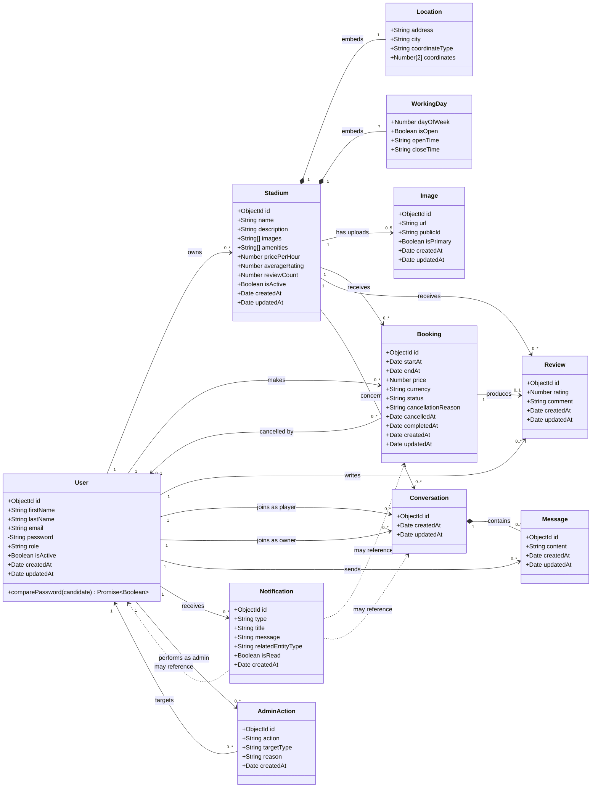

# Malaab Backend — Class Diagram

This document describes the persisted domain model of the Malaab backend. It is generated from the Mongoose schemas in `src/modules` and shows the main classes, embedded value objects, enums, and relationships between collections.

## Domain class diagram

## Relationship guide

| Relationship | Meaning |
| --- | --- |
| `User → Stadium` | An owner can create multiple stadiums; every stadium belongs to one owner. |
| `Stadium ◆→ Location` | Location is embedded directly inside the stadium document. |
| `Stadium ◆→ WorkingDay` | Each stadium embeds a seven-day working-hours schedule. |
| `Stadium → Image` | Uploaded Cloudinary images are stored as separate image documents and belong to one stadium. |
| `User → Booking` | A player can create multiple bookings. |
| `Stadium → Booking` | A stadium can receive multiple bookings. |
| `Booking → Review` | A completed booking can produce at most one review because `bookingId` is unique. |
| `Conversation ◆→ Message` | A conversation contains messages; every message belongs to one conversation. |
| `Notification ⇢ related entity` | `relatedEntityType` and `relatedEntityId` form a polymorphic reference to a booking, conversation, or user. |
| `AdminAction → User` | An administrator action records both the administrator and the targeted user. |

## Important model constraints

- `User.email` is unique, normalized to lowercase, and passwords are hashed before saving.
- `Stadium.location.coordinates` has a `2dsphere` index for geospatial queries.
- Stadium working days use values `0` through `6` and are embedded without individual IDs.
- `Image.stadiumId`, `Booking.playerId`, `Booking.stadiumId`, and other frequently queried references are indexed.
- A conversation is unique for one player, one owner, and one stadium.
- Messages are indexed by conversation and creation date.
- Review ratings are integers in the application layer and restricted to the range `1–5` by the schema.
- One booking can have only one review.
- Notifications are indexed by recipient/date and recipient/read status.
- `Notification.relatedEntityId` and `AdminAction.targetId` are logical references rather than Mongoose `ref` fields.

## Source mapping

| Diagram class | Source file |
| --- | --- |
| `User` | `src/modules/auth/auth.model.ts` |
| `Stadium`, `Location`, `WorkingDay` | `src/modules/stadium/stadium.model.ts` |
| `Image` | `src/modules/image/image.model.ts` |
| `Booking` | `src/modules/booking/booking.model.ts` |
| `Review` | `src/modules/review/review.model.ts` |
| `Conversation`, `Message` | `src/modules/conversation/conversation.model.ts` |
| `Notification` | `src/modules/notifications/notifications.model.ts` |
| `AdminAction` | `src/modules/admin/admin.model.ts` |

> Note: `Stadium.images` exists as a string array in the stadium schema while uploaded images are also represented by the separate `Image` collection. Both are included because both structures exist in the current backend model.
